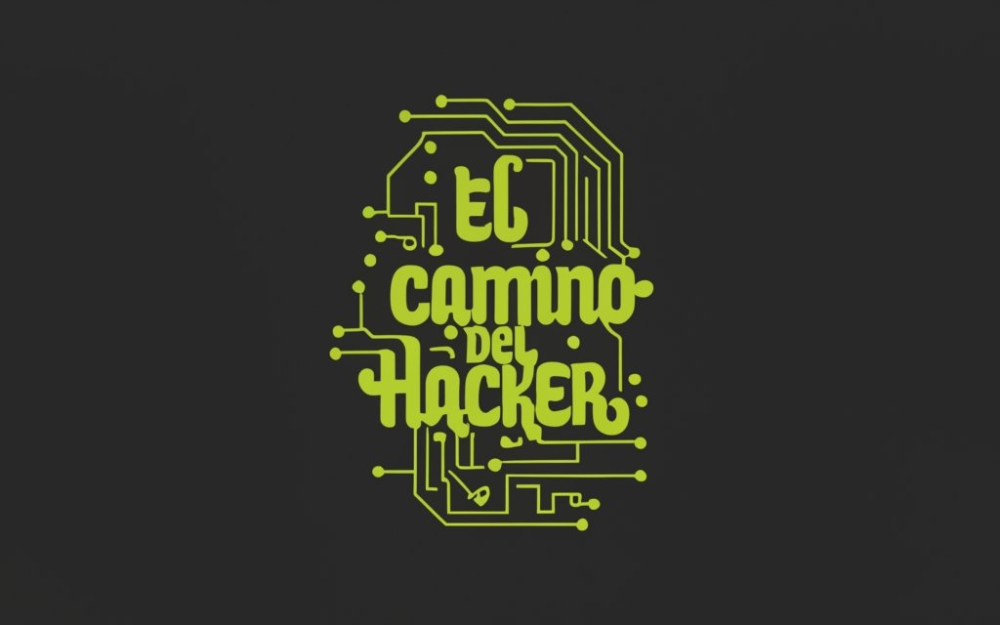

---
layout:
  title:
    visible: true
  description:
    visible: false
  tableOfContents:
    visible: true
  outline:
    visible: true
  pagination:
    visible: true
---

# El camino del hacker

<figure><figcaption></figcaption></figure>

**¡Bienvenido a "El Camino del Hacker"!**

En este fascinante viaje hacia el mundo del hacking ético, se te proporciona una guía completa, comenzando desde cero. Esta página está diseñada para aquellos que desean sumergirse en el emocionante campo de la ciberseguridad, sin importar su nivel de experiencia previa, incluso si es nula.

**Aprendizaje Integral desde Cero**: Desde los conceptos básicos hasta técnicas avanzadas. Iniciamos desde cómo familiarizarte con el sistema operativo Linux, una herramienta fundamental en el arsenal de cualquier hacker ético. A medida que avanzas, explorarás la detección de vulnerabilidades web, técnicas de hacking ético, y mucho más.

**Estructura Adaptable**: Esta web está organizada de manera lógica y estructurada, permitiéndote avanzar según tu propio ritmo y nivel de conocimiento. Si ya tienes habilidades en ciertas áreas, puedes dirigirte directamente a los módulos que te desafíen o que desees perfeccionar. Además, se ofrece una búsqueda intuitiva para acceder rápidamente a información específica.

**Módulos Fundamentales**: Hay que mencionar que los cimientos sólidos son esenciales. Por ello, nos centramos en dos módulos básicos cruciales: Linux y Redes. Estos conocimientos son la base sobre la cual construirás tus habilidades en hacking ético. Sin comprender estos fundamentos, el camino hacia la maestría en ciberseguridad puede resultar complicado.

**Énfasis en Hacking Ético**: Cabe destacar que el enfoque de esta página web es exclusivamente ético. Todas las enseñanzas y prácticas se realizan con fines educativos, con el objetivo de fortalecer la seguridad digital. Se intenta promover una comunidad comprometida con la ética y la responsabilidad.

**Contribuye y Colabora**: Si encuentras algo que puedes mejorar o deseas agregar contenido valioso, te agradecería el contribuir a través de pull requests en mi [repositorio de GitHub](https://github.com/M3RINOOOOO/El-camino-del-hacker).&#x20;

Embárcate en "El Camino del Hacker" y descubre el apasionante mundo de la ciberseguridad desde una perspectiva ética.&#x20;
